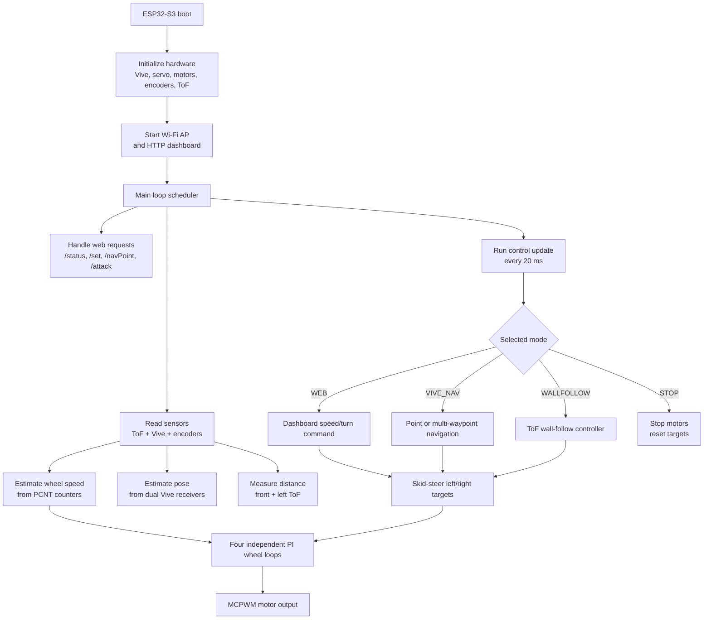
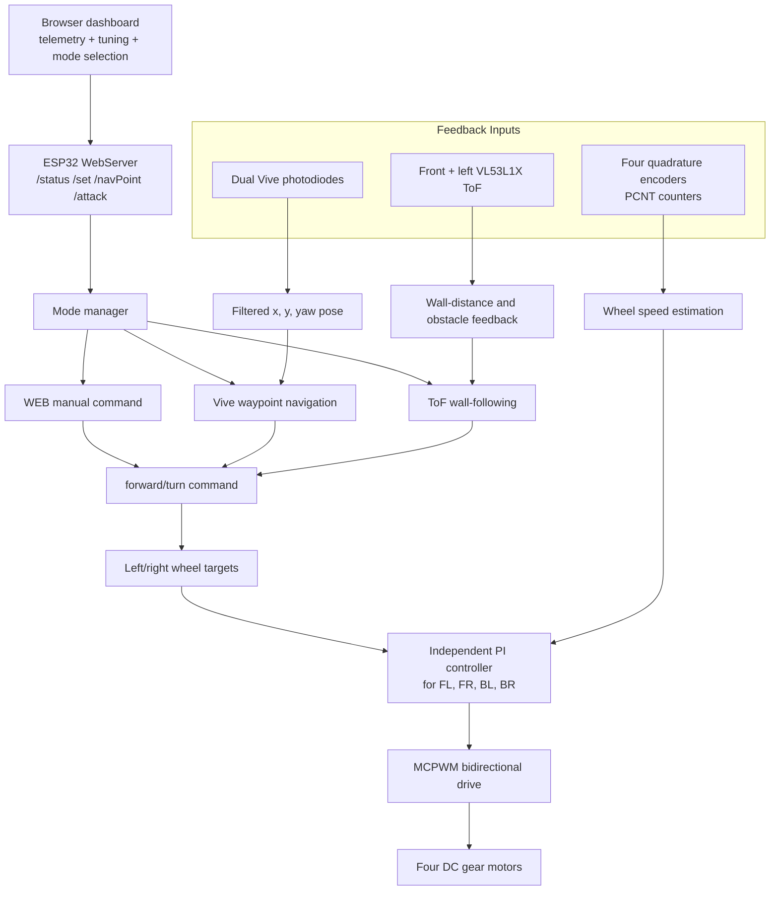
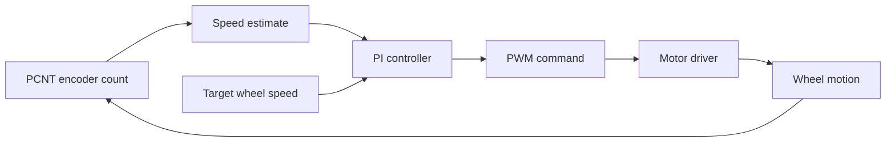

+++
title = 'Four-Wheel Wi-Fi Controlled Robot Car'
date = 2025-11-20
+++

[[button:GitHub Repository](https://github.com/wjx5037/4WD-Wifi-Controlled-Robot-Car-with-ToF-Vive-)]



## Project Goal

Build a four-wheel embedded mobile robot that can be driven through a Wi-Fi dashboard, regulate wheel speed with encoder feedback, sense nearby obstacles with ToF sensors, and execute autonomous navigation behaviors using Vive photodiode localization.

The final system supports four operating modes:

- Web manual control: browser-based speed, steering, and PID tuning.
- Vive navigation: point-to-point and multi-waypoint movement using estimated pose.
- Wall following: ToF-based lateral distance regulation and obstacle handling.
- Stop/safety mode: immediate motor stop from the web interface or top-hat signal.

## Program Logic Structure

## Control Architecture

## Core Methods

### Hardware and Electrical Stack



- ESP32-S3 acts as the central controller and hosts the Wi-Fi access point.
- Four DC gear motors are driven with bidirectional PWM through high-current motor drivers.
- Four quadrature encoders provide per-wheel feedback through ESP32 PCNT units.
- Front and left VL53L1X ToF sensors provide obstacle and wall-distance measurements.
- Two Vive photodiodes estimate robot position and yaw for navigation.

### Wi-Fi Dashboard and Runtime Tuning

The ESP32 runs a lightweight web server in AP mode. The browser dashboard exposes live telemetry and control parameters without reflashing firmware:

- live encoder counts, wheel speeds, ToF distances, Vive pose, and current mode
- target speed, turning command, and per-wheel PI gains
- mode switching between WEB, NAV, WALL, and STOP
- waypoint and task buttons through `/navPoint` and `/attack`

### Wheel Speed Control

Each wheel runs an independent PI controller. Encoder counts are sampled through PCNT, converted into wheel speed, and compared against the target speed. The controller applies deadband handling, integral limiting, and minimum PWM compensation so the robot can start from static friction and keep low-speed motion stable.

### ToF Wall Following

The wall-following mode uses the left ToF sensor as the lateral error signal and the front ToF sensor as a blockage detector. When the path is clear, the controller adjusts turning based on distance error and error change. When the front distance becomes too small, forward speed is reduced and the robot turns away.

### Vive Navigation

The navigation mode uses two Vive receivers to estimate x/y position and yaw. The firmware filters recent Vive readings, rejects large jumps, computes the direction to the target waypoint, and drives with distance and heading feedback. Multi-stage waypoint routes are handled by advancing to the next target after the current point is reached.

## Implementation Modules

- `setupWiFiAndWeb()`: creates the ESP32 access point and registers dashboard/control routes.
- `handleStatus()` and `handleSet()`: stream telemetry and receive runtime tuning commands.
- `setupEncoders()` / `readEncoders()`: configure four PCNT counters and read wheel feedback.
- `updatePID()`: runs the four wheel-speed PI loops at a fixed update interval.
- `wallFollow()`: converts ToF distance error into turn commands.
- `updateVivePose()` and `navigateToTarget()`: estimate pose and drive toward waypoint targets.
- `loop()`: schedules web handling, PID updates, sensor reads, and mode-specific behavior.

## Hardware Iterations






The first version validated the drivetrain, web control, and encoder feedback. The second version reorganized the chassis, wiring, controller placement, sensor mounting, and power distribution to make the platform more reliable for autonomous testing.

## Results



- Built a complete ESP32-S3 mobile robot with Wi-Fi control, telemetry, and runtime tuning.
- Implemented four-wheel closed-loop speed control using quadrature encoder feedback.
- Added ToF-based wall following and obstacle handling.
- Added Vive-based pose estimation and multi-stage waypoint navigation.
- Reworked the mechanical/electrical layout from V1 to V2 for cleaner wiring, stronger sensor mounting, and more reliable testing.
