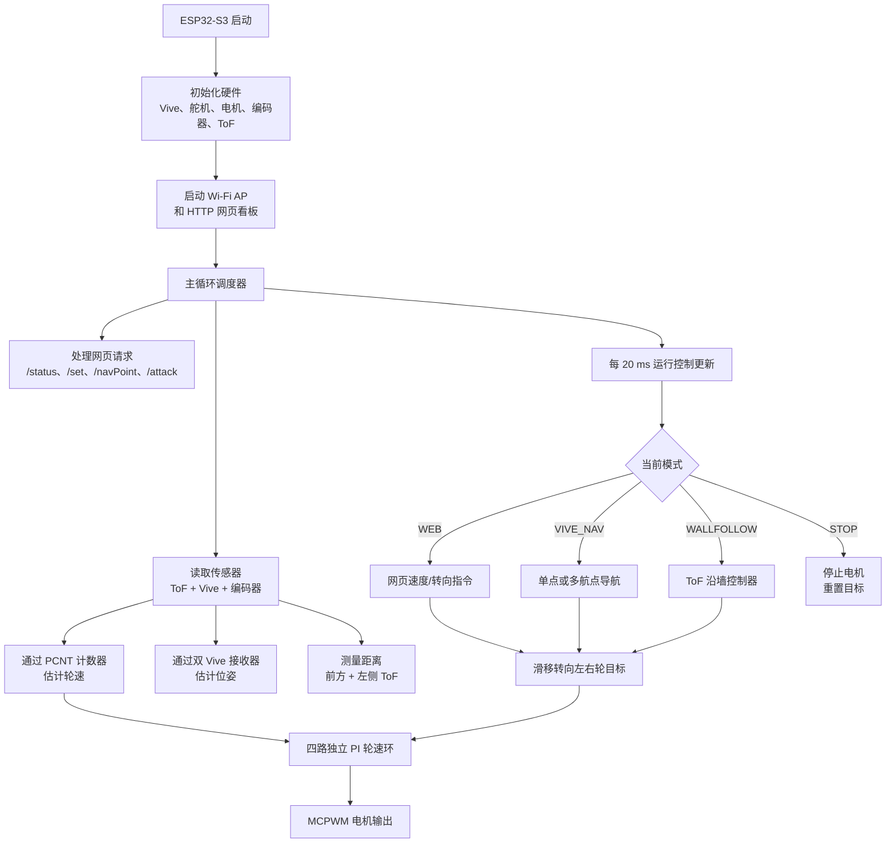
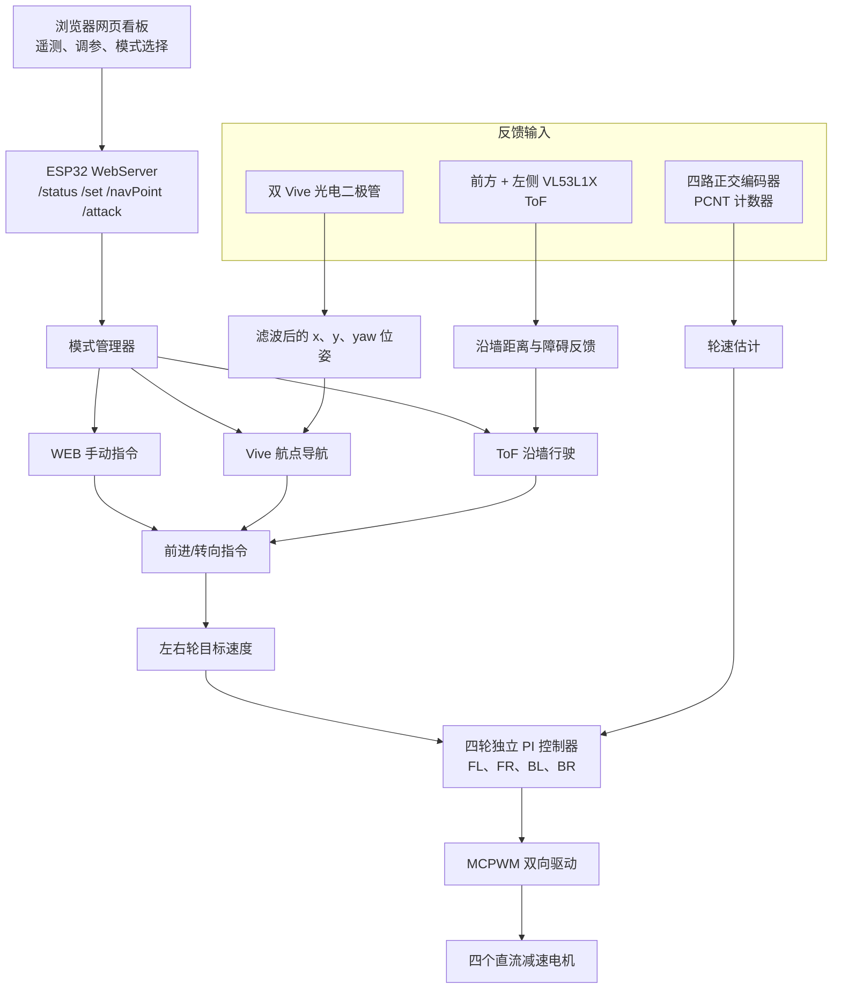
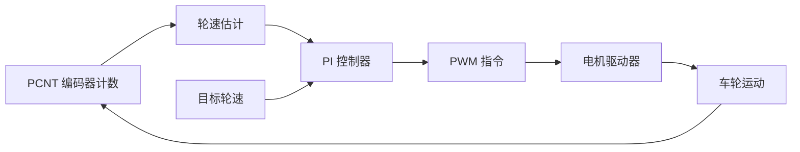

+++
title = '四轮 Wi-Fi 控制机器人车'
date = 2025-11-20
+++

[[button:GitHub 仓库](https://github.com/wjx5037/4WD-Wifi-Controlled-Robot-Car-with-ToF-Vive-)]



## 项目目标

搭建一台四轮嵌入式移动机器人，可通过 Wi-Fi 网页看板控制，使用编码器反馈调节轮速，利用 ToF 传感器感知近距离障碍，并通过 Vive 光电定位执行自主导航行为。

最终系统支持四种运行模式：

- 网页手动控制：在浏览器中调整速度、转向和 PID 参数。
- Vive 导航：基于估计位姿完成点到点和多航点运动。
- 沿墙行驶：基于 ToF 的横向距离控制与障碍物处理。
- 停止/安全模式：可由网页界面或顶帽信号立即停止电机。

## 程序逻辑结构

## 控制架构

## 核心方法

### 硬件与电气架构



- ESP32-S3 作为中央控制器，并承载 Wi-Fi 接入点。
- 四个直流减速电机通过大电流电机驱动器实现双向 PWM 控制。
- 四个正交编码器通过 ESP32 PCNT 单元提供单轮反馈。
- 前方和左侧 VL53L1X ToF 传感器提供障碍物和墙面距离测量。
- 两个 Vive 光电二极管用于估计机器人位置与航向角。

### Wi-Fi 网页看板与运行时调参

ESP32 在 AP 模式下运行轻量网页服务器。浏览器看板允许在不重新烧录固件的情况下查看实时数据并修改控制参数：

- 实时编码器计数、轮速、ToF 距离、Vive 位姿和当前模式。
- 目标速度、转向指令和四路 PI 参数。
- WEB、NAV、WALL 和 STOP 模式切换。
- 通过 `/navPoint` 和 `/attack` 触发航点与任务动作。

### 轮速闭环控制

每个车轮独立运行 PI 控制器。系统通过 PCNT 采样编码器计数并换算轮速，再与目标速度比较。控制器实现死区处理、积分限幅和最小 PWM 补偿，以克服静摩擦并维持低速运动稳定性。

### ToF 沿墙行驶

沿墙模式以左侧 ToF 传感器作为横向误差信号，以前方 ToF 传感器检测障碍。当路径通畅时，控制器依据距离误差及其变化量调整转向；当前方距离过小时，系统降低前进速度并向远离障碍的一侧转向。

### Vive 导航

导航模式使用两个 Vive 接收器估计 x/y 位置和 yaw。固件对近期 Vive 数据滤波并剔除大幅跳变，计算当前点到目标航点的方向，然后利用距离与航向误差反馈驱动机器人。多阶段路线在到达当前航点后自动切换至下一目标。

## 程序模块

- `setupWiFiAndWeb()`：创建 ESP32 接入点并注册网页看板与控制路由。
- `handleStatus()` 和 `handleSet()`：发送遥测数据并接收运行时调参指令。
- `setupEncoders()` / `readEncoders()`：配置四路 PCNT 计数器并读取车轮反馈。
- `updatePID()`：以固定周期运行四路轮速 PI 控制。
- `wallFollow()`：将 ToF 距离误差转换为转向指令。
- `updateVivePose()` 和 `navigateToTarget()`：估计位姿并驱动至航点目标。
- `loop()`：调度网页处理、PID 更新、传感器读取和各模式行为。

## 硬件迭代






第一版完成了传动系统、网页控制和编码器反馈的验证。第二版重新组织底盘、布线、控制器位置、传感器安装和供电分配，使平台更适合可靠的自主测试。

## 结果



- 完成具备 Wi-Fi 控制、遥测和运行时调参功能的 ESP32-S3 移动机器人。
- 通过正交编码器反馈实现四轮闭环速度控制。
- 实现基于 ToF 的沿墙行驶与障碍处理。
- 实现基于 Vive 的位姿估计和多阶段航点导航。
- 将机械/电气布局由 V1 优化至 V2，获得更清晰的布线、更稳固的传感器安装和更可靠的测试表现。
