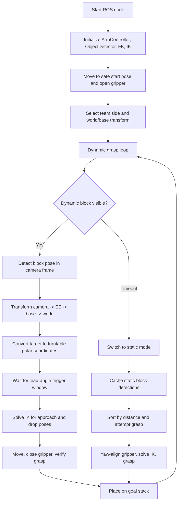
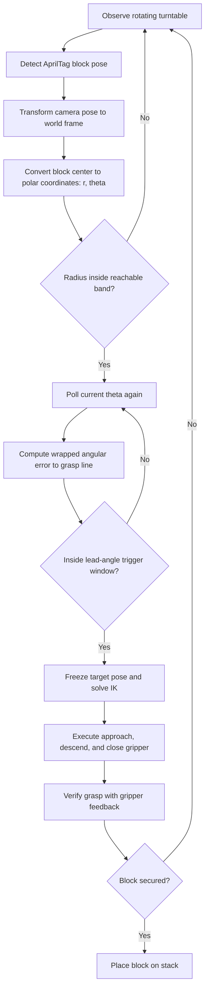

+++
title = 'Autonomous Robotic Manipulation System (Franka Emika Panda)'
date = 2025-12-20
+++

[[button:GitHub Repository](https://github.com/wjx5037/Franka-Robot-Manipulation-System-Control)]
[[button:Real Robot Grasping Video](https://drive.google.com/file/d/1aUSOK_oHtc0gYIpPaPrK1bFyV4XfTu81/view?usp=drive_link)]



## Project Goal

Build an autonomous manipulation system that can detect blocks, decide a grasp strategy, execute safe robot motion, verify grasp success, and place blocks onto a goal stack.

The project covers two task modes:

- Static block grasping: detect a stationary block, estimate its planar orientation, align the gripper, grasp from above, and place it onto the stack.
- Dynamic block interception: track a moving block on a rotating turntable, predict when it reaches the grasp line, trigger motion early, and compensate for sensing and actuation delay.

## Program Logic Structure

## Polling-Based Dynamic Interception Strategy

Instead of estimating a single arrival time for a moving block, the dynamic grasp mode uses a closed-loop angular polling strategy. The system repeatedly re-detects the target, converts its position into turntable polar coordinates, and triggers the grasp only when the block enters the predefined grasp-angle window.

This makes the interception less sensitive to turntable speed drift, AprilTag detection delay, and robot actuation latency than a pure time-based open-loop prediction.



## Core Methods

### Perception and Coordinate Frames

- Use the end-effector-mounted camera and AprilTag detections to obtain block poses in the camera frame.
- Compute the current end-effector pose from forward kinematics.
- Convert detections through the transform chain:

$$
T_{WB} = T_{WEE}(q) \cdot T_{EEC} \cdot T_{CB}
$$

- Apply conservative z-height limits and empirical offsets to improve hardware robustness.

### Static Grasping



- Detect all static blocks from the observation pose.
- Sort candidates by distance from the robot base.
- Estimate the block planar edge from the detected rotation matrix.
- Compute a gripper yaw angle perpendicular to the block edge.
- Execute a multi-stage motion:
  - approach above the block
  - yaw-align gripper
  - descend vertically
  - close gripper
  - lift and verify

### Dynamic Turntable Interception

- Convert each dynamic block center into polar coordinates around the turntable:

$$
r = \sqrt{(x - c_x)^2 + (y - c_y)^2}
$$

$$
\theta = atan2(y - c_y, x - c_x)
$$

- Keep only targets within reachable radius limits.
- Use a lead-angle trigger:

$$
\Delta(t) = wrap\_to\_pi(\theta(t) - \theta_{grasp})
$$

$$
\Delta(t) \ge -\theta_{lead}
$$

- Trigger the grasp slightly before the block reaches the grasp line to compensate for perception delay and robot motion latency.

### IK and Motion Execution

- Solve IK for world-frame approach and drop poses after converting targets into the correct robot base frame.
- Use a fixed hand-down end-effector orientation to reduce singularity risk.
- Use the previous valid joint state as the IK seed.
- If IK fails, abort the attempt, return to a safe observation pose, and reselect a target.

### Grasp Verification

The system does not assume a grasp succeeded just because the close command was sent. It checks gripper state:

$$
g_{min} \le gap \le g_{max} \quad OR \quad force \ge F_{thresh}
$$

If the grasp is verified, the robot places the block onto the goal stack. If not, it retries safely.

## Implementation Modules

- `Final_integration.py`: top-level task loop, static/dynamic mode switching, placement logic, and safety recovery.
- `calculateFK.py`: forward kinematics for current end-effector pose.
- `IK_position_null.py`: IK solver used for approach, grasp, and place poses.
- `ObjectDetector`: AprilTag/object pose detection and camera extrinsic access.
- `ArmController`: safe joint-space motion, gripper command, and gripper feedback.

## Results

- Static grasping: orientation-aware top-down grasp with gripper yaw alignment.
- Dynamic grasping: turntable interception using radius filtering and lead-angle timing.
- Placement: successful block placement onto a goal stack with feedback-based grasp validation.
- Robustness: fallback behavior for IK failure, missing detections, failed grasp verification, and match-time limits.
