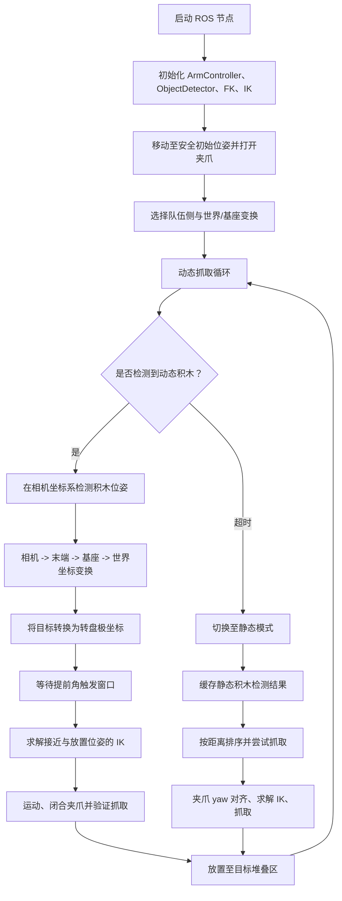
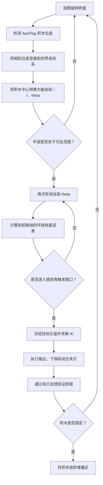

+++
title = 'Franka Emika Panda 自主机器人抓取系统'
date = 2025-12-20
+++

[[button:GitHub 仓库](https://github.com/wjx5037/Franka-Robot-Manipulation-System-Control)]



## 项目目标

构建一套自主操作系统，使机械臂能够检测积木、决定抓取策略、执行安全运动、验证抓取是否成功，并将积木堆放到目标位置。

项目覆盖两类任务：

- 静态积木抓取：检测静止积木、估计平面朝向、对齐夹爪、从上方抓取并堆放到目标位置。
- 转盘动态拦截：追踪转盘上的运动积木，判断其到达抓取线的时机，提前触发运动并补偿感知与执行延迟。

## 程序逻辑结构

## 基于轮询的动态拦截策略

动态抓取并不依赖对运动积木到达时间的一次性估计，而是采用闭环角度轮询策略。系统重复检测目标，将其位置转换为转盘极坐标；仅当积木进入预先定义的抓取角窗口时，才真正触发抓取。

与纯粹基于时间的开环预测相比，该方法对转盘转速漂移、AprilTag 检测延迟和机械臂执行延迟更不敏感。



## 核心方法

### 感知与坐标系

- 使用安装在末端的相机和 AprilTag 检测结果，获得相机坐标系中的积木位姿。
- 通过正运动学计算当前末端位姿。
- 按以下变换链将检测结果转换到世界坐标系：

$$
T_{WB} = T_{WEE}(q) \cdot T_{EEC} \cdot T_{CB}
$$

- 使用保守的 z 高度限制和经验偏移，提高真实硬件中的鲁棒性。

### 静态抓取



- 在观察位姿检测所有静态积木。
- 按积木与机械臂基座的距离对候选目标排序。
- 从检测到的旋转矩阵估计积木平面边缘方向。
- 计算与积木边缘垂直的夹爪 yaw 角。
- 执行多阶段运动：
  - 在积木上方接近
  - 夹爪 yaw 对齐
  - 垂直下探
  - 闭合夹爪
  - 抬升并验证

### 转盘动态拦截

- 将每个动态积木中心转换为相对于转盘中心的极坐标：

$$
r = \sqrt{(x - c_x)^2 + (y - c_y)^2}
$$

$$
\theta = atan2(y - c_y, x - c_x)
$$

- 仅保留半径位于机械臂可达范围内的目标。
- 使用提前角触发条件：

$$
\Delta(t) = wrap\_to\_pi(\theta(t) - \theta_{grasp})
$$

$$
\Delta(t) \ge -\theta_{lead}
$$

- 在积木到达抓取线前稍早触发动作，以补偿感知延迟与机械臂运动延迟。

### IK 与运动执行

- 本项目使用的运动学与运动控制层由我自行编写：正运动学、带零空间控制的位置级逆运动学（IK），以及用于末端微分运动的速度逆运动学（VIK）。机器人接口用于安全执行指令，而非作为黑盒 IK 求解器。
- 将目标转换到正确的机械臂基座坐标系后，求解世界坐标系下的接近与放置位姿 IK。
- 使用固定的手朝下末端姿态，降低接近奇异位形的风险。
- 以上一次有效关节状态作为 IK 初值。
- 若 IK 求解失败，则中止当前尝试、返回安全观察位姿并重新选择目标。

### 抓取验证

系统不会因为发送了闭合夹爪指令就假定抓取成功，而是读取夹爪状态：

$$
g_{min} \le gap \le g_{max} \quad OR \quad force \ge F_{thresh}
$$

验证通过后，机械臂将积木放置到目标堆叠区；若失败，则安全地重新尝试。

## 程序模块

- `Final_integration.py`：顶层任务循环、静态/动态模式切换、堆叠逻辑和安全恢复。
- `calculateFK.py`：我自行编写的正运动学，用于计算当前末端位姿。
- `IK_position_null.py`：我自行编写的带零空间控制的位置级 IK，用于接近、抓取和放置位姿。
- 自定义 VIK 程序：基于雅可比矩阵的关节速度映射，用于末端微分运动和在线目标更新。
- `ObjectDetector`：AprilTag/物体位姿检测和相机外参获取。
- `ArmController`：安全关节空间运动、夹爪指令与夹爪反馈。

## 结果

- 静态抓取：具有姿态感知能力的上方抓取，夹爪可按积木边缘完成 yaw 对齐。
- 动态抓取：使用半径筛选和提前角轮询触发，完成转盘目标拦截。
- 堆叠放置：通过反馈式抓取验证后，将积木成功放到目标堆叠区。
- 鲁棒性：针对 IK 失败、漏检、抓取验证失败和比赛时间限制设置回退行为。
